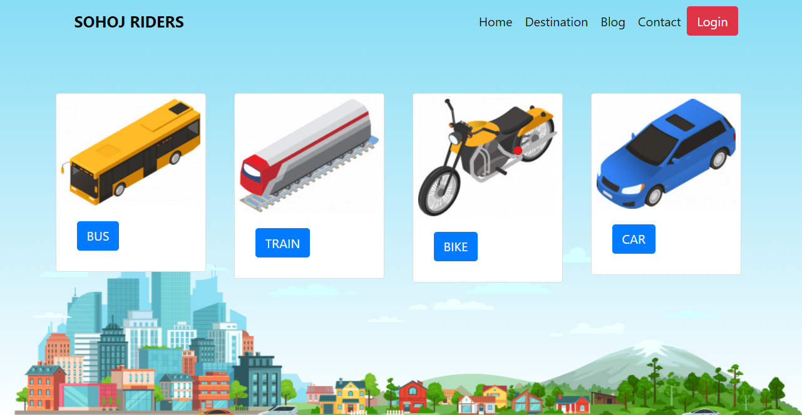
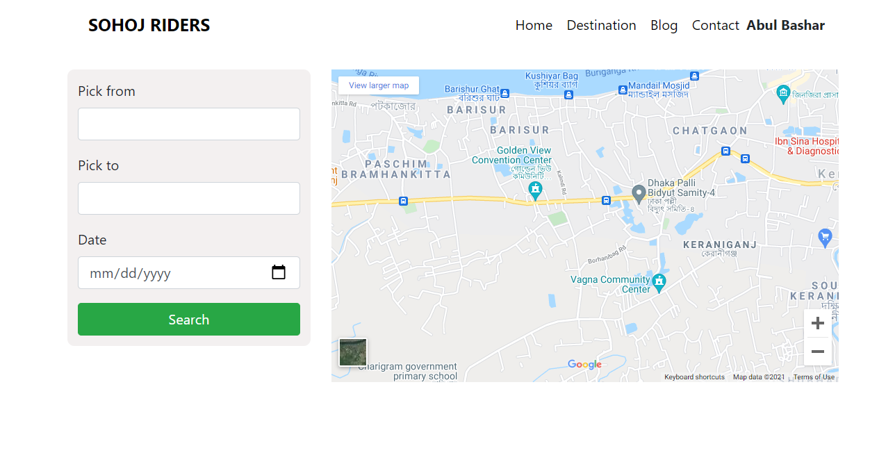
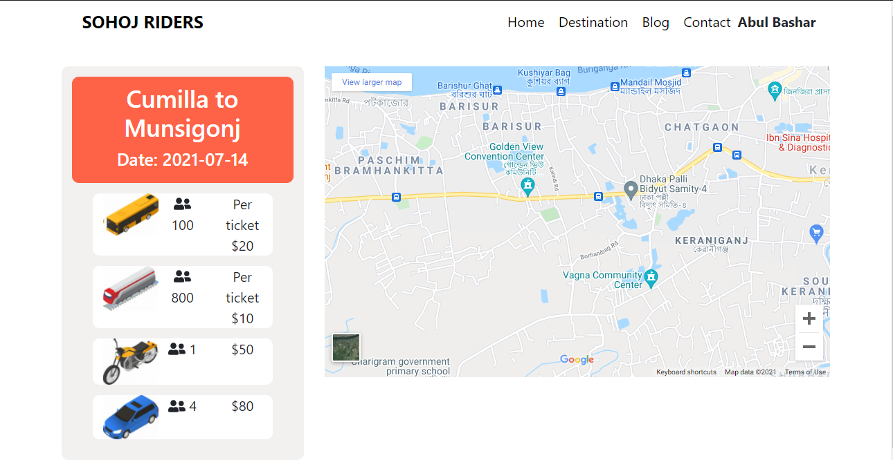

# [SOHOJ RIDERS](https://sohoj-riders.web.app/) | [Github](https://github.com/AbulBashar38/sohoj-rider-client)
The name of this web site is 'SOHOJ RIDERS' that means an easy transport system. In the home page of the web side you can see some transport ride named BIKE,TRAIN,CAR,BUS. If you click any button of the ride you will see that web side wants to verified you. For that you have to create an account account. if you want to create your account by your google account it is possible in this web site. For that just click the 'login with Google' button. After verified you can choose you destination. Thank you...  

# Features:
* Bike, Train, Car, Bus 4 option in the home page.
* Click any one and redirect to login page which is created by React router.
* Create new user, login existence user and login by google option are available. All are developed by Firebase
* Select destination place and date.
* show hiring details
 # Technology:
 * HTML5
 * CSS3
 * Material UI
 * React JS
 * React Router
 * Firebase
 * Google map
 ## Home page
 
 ## Destination page
  
 ## Confirm hiring page
  
